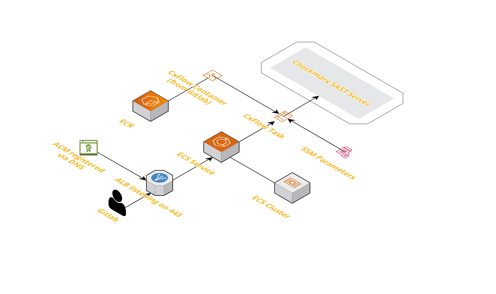

# CxFlow

This repository manages a module to deploy CxFlow to AWS ECS

## Using

This is intended to be used as a module and so can be embedded in other Terraform repositories.  The best way to see how to use it is by cloning and trying out the example repository on how to use this, which includes additional details on how to launch a fully functional CxFlow service:

https://github.com/Cimpress-MCP/cxflow-ecs-example

## Resources

This repository builds the following resources:

- A VPC for the cluster
- An ECR repository for storing/deploying containers for the cluster
- SSM Parameters that CxFlow needs (although this does not populate the values - [more below](#SSM-Parameters))
- Necessary IAM roles and Security groups for the cluster and all related resources
- An Application load balancer (which only accepts traffic from Gitlab's public runners)
- An ACM for the ALB, automatically registered via DNS
- An ECS cluster
- An ECS service
- The CxFlow task definition

## External Resources

This repository requires the following external items in order to actually do anything:

- The CxFlow image must be built and saved into the ECR repository with the `latest` tag
- The SSM parameters must be populated with the [necessary values](#SSM-Parameters)
- A Route53 hosted zone
- A running checkmarx server

## Architecture

Below is an architecture diagram for the resulting cluster:

## Inputs

This module accepts the following inputs:

| Input                 | Required | Default                                           | Description                                                                                |
|-----------------------|----------|---------------------------------------------------|--------------------------------------------------------------------------------------------|
| region                | Yes      |                                                   | The AWS Region to deploy the cluster to                                                    |
| dns_zone              | Yes      |                                                   | The name of the Route53 DNS zone to use for the domain/ACM                                 |
| domain                | Yes      |                                                   | The domain to make the cluster available on                                                |
| name                  | No       | cxflow                                            | The "name" of the cluster - will be used in the name for all AWS resources                 |
| environment           | No       | development                                       | The environment - will be attached as a tag and included in the name for all AWS resources |
| desired_service_count | No       | 1                                                 | The desired number of instances to use for the service                                     |
| cidr_block            | No       | 10.0.0.0/16                                       | The CIDR block to use for the VPC                                                          |
| private_subnets       | No       | "10.0.1.0/24", "10.0.2.0/24", "10.0.3.0/24"       | A list of CIDR blocks to use for the private subnets in the VPC                            |
| public_subnets        | No       | "10.0.101.0/24", "10.0.102.0/24", "10.0.103.0/24" | A list of CIDR blocks to use for the public subnets in the VPC                             |
| container_insights    | No       | enabled                                           | Whether or not to enable container insights on the ECS cluster                             |
| tags                  | No       | {}                                                | A map containing tags which will be attached to all AWS resources                          |

## SSM Parameters
